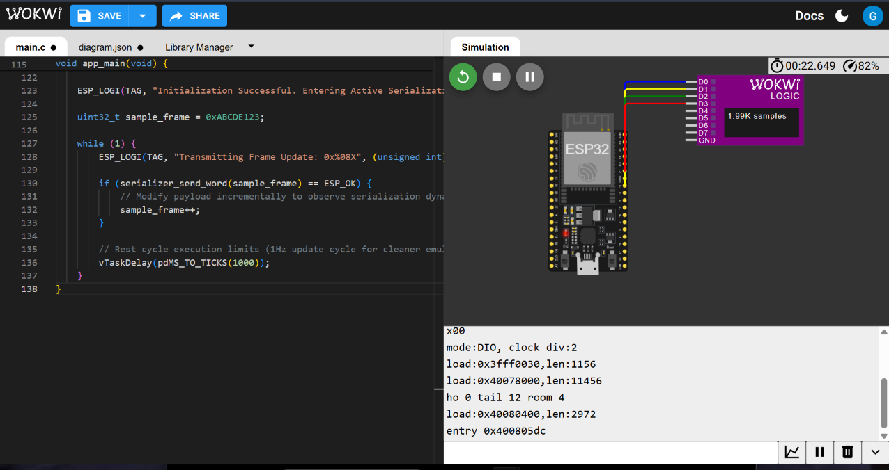

# ESP32 SPI Master & Serializer Core Interface (ESP-IDF)

> **Overview:** An embedded firmware implementation of a high-speed serialization driver for ESP32 microcontrollers written in C using the native **ESP-IDF framework**. Interfaced with simulated logic analyzer instrumentation to verify bit-serial transmission updates.

## Technical Specifications
* **Microcontroller:** ESP32 (Xtensa LX6 Dual-Core)
* **Framework:** ESP-IDF (Native C Language)
* **Simulation Platform:** Wokwi Embedded Simulator
* **Instrumentation:** 4-Channel Digital Logic Analyzer Emulation
* **Key Embedded Concepts:** Bitwise shift operations, register manipulation, FreeRTOS task handling (`vTaskDelay`), frame encoding.

## Simulation & Logic Analyzer Verification

The image below demonstrates the active Wokwi hardware emulation running with real-time serial terminal logs and logic analyzer signal capture:

## Firmware Architecture Breakdown
1. **Payload Generation:** Initializes 32-bit sample data frames (`0xABCDE123`).
2. **Serialization Engine:** Converts multi-byte integers into sequential bit streams transmitted over configured output pins.
3. **Execution Loop:** Dynamically updates payload data on each transmission cycle (`sample_frame++`) and logs execution state via ESP-IDF `ESP_LOGI` macros.
4. **RTOS Scheduling:** Integrates `vTaskDelay(pdMS_TO_TICKS(1000))` to safely manage CPU scheduling and watchdog timer windows.
